# 📊 Data Entry & Data Processing Portfolio

Welcome! I'm **Mico Raphael F. Cuarto**, a Computer Science graduate with hands-on experience in **data entry, data processing, spreadsheet management, data validation, and data cleaning**. This repository showcases how I work with large structured datasets through academic and internship projects.

My goal is to demonstrate the skills I can bring to **Data Entry**, **Virtual Assistant**, **Administrative Support**, **Operations Support**, and **Data Processing** roles.

---

## 👨‍💻 About Me

I have experience processing, organizing, cleaning, and validating large datasets while maintaining high levels of accuracy and consistency.

Throughout my internship and academic projects, I have worked with **15,000+ total records**, ensuring that data was properly structured for reporting, database integration, and system implementation.

I enjoy organizing information, improving data quality, and building efficient workflows using spreadsheets, structured databases, and practical reporting outputs.

---

## 🛠️ Technical Skills

### 📋 Data Entry & Data Processing

- Data Entry
- Data Encoding
- Data Cleaning
- Data Validation
- Spreadsheet Management
- Data Organization
- Document Processing
- Data Quality Assurance
- Records Reconciliation
- Reporting Preparation

### 📊 Tools

- Microsoft Excel
  - Pivot Tables
  - Sorting & Filtering
  - Data Validation
  - Conditional Formatting
  - Basic Formulas
  - XLOOKUP/VLOOKUP
- Google Sheets
- SQL
- PostgreSQL
- Python
- Jupyter Notebook

---

# 📁 Portfolio Projects

## 🚨 GUIDE – Disaster Risk Management Platform

**Role:** Data Processing & Database Preparation

**Dataset Size:** **10,000+ records**

### Project Overview

GUIDE is a disaster risk management platform that uses geospatial and disaster-related data to support reporting and decision-making.

### Responsibilities

- Processed and organized datasets containing over **10,000 records**
- Cleaned and validated structured datasets
- Standardized inconsistent entries and formatting
- Organized geospatial information for reporting
- Prepared datasets for PostgreSQL database integration
- Maintained data accuracy and consistency across records

### Skills Demonstrated

- Data Entry
- Data Cleaning
- Data Validation
- Spreadsheet Management
- Database Preparation
- SQL

---

## 🎓 Thesis Project

**Role:** Data Processing & Dataset Management

**Dataset Size:** **5,000+ records**

### Project Overview

Managed and prepared structured datasets used for system development and analysis.

### Responsibilities

- Managed and encoded over **5,000 structured records**
- Organized datasets for system implementation
- Performed validation and consistency checks
- Corrected formatting inconsistencies
- Maintained accurate and organized records throughout development

### Skills Demonstrated

- Data Entry
- Data Validation
- Data Cleaning
- Spreadsheet Organization
- Documentation

---

## 📷 Dataset Workflow

### Before Data Processing

  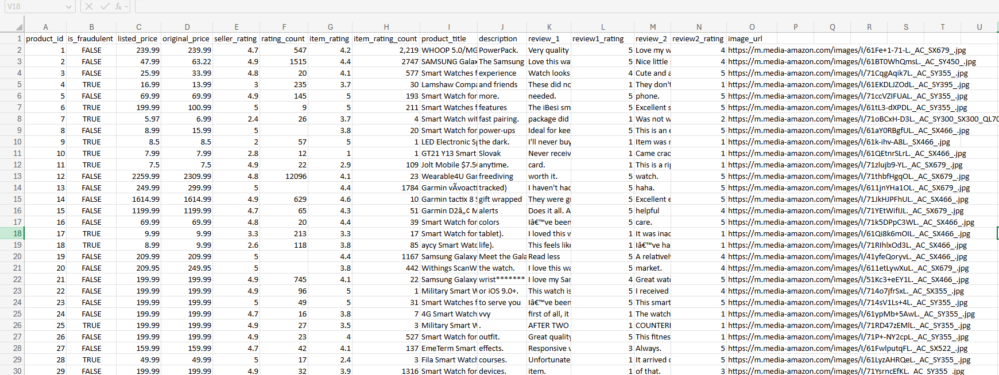

> Original dataset before validation, cleaning, and organization.

---

### After Data Processing

  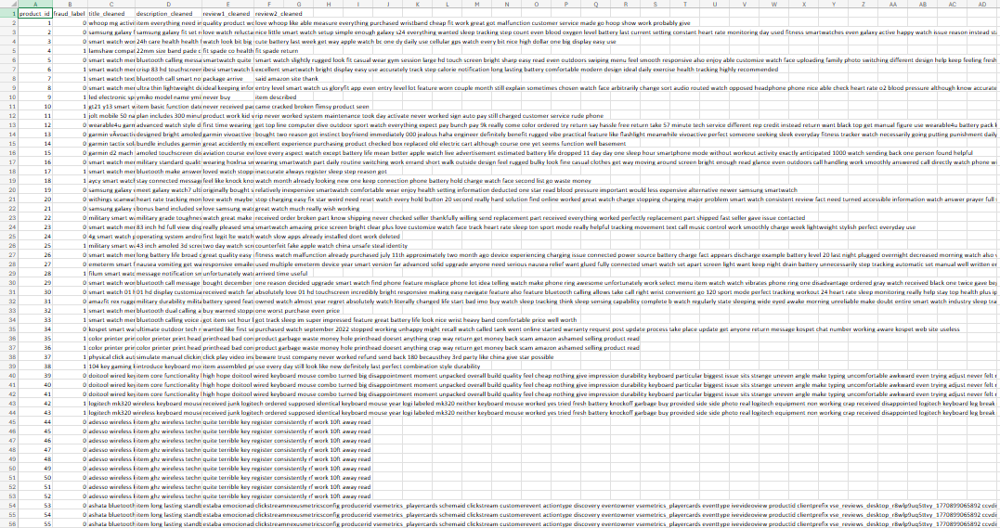

> Cleaned and standardized dataset after processing.

---

  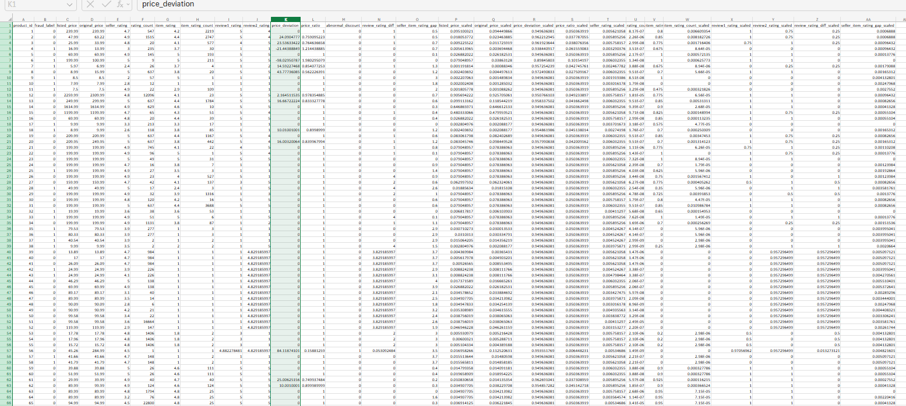

> Validation and organization applied to improve data quality.

---

  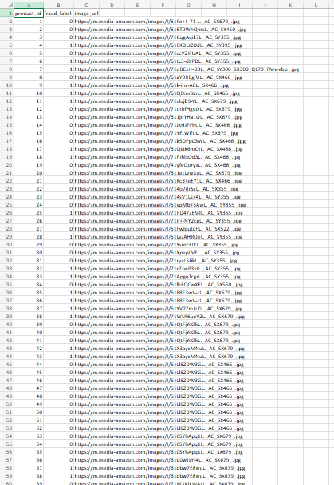

> Final structured dataset prepared for system implementation.

---

## 📈 Excel Data Cleaning Case Study

**Project:** BrightPath Solutions Inc. Excel Data Cleaning Case Study

**Role:** Data Cleaning, Spreadsheet Management, and Reporting Preparation

**Dataset Size:** **3,620 raw records** transformed into **3,500 clean records**

### Project Overview

This finished case study demonstrates a complete Microsoft Excel workflow for cleaning, validating, and preparing employee records for reporting.

The project includes raw data review, duplicate handling, formatting cleanup, validation checks, and final reporting visuals built from the cleaned dataset.

The before-and-after screenshots below compare the same rows from the raw and cleaned dataset so the improvements are easy to see at a glance.

### What I Did

- Reviewed the raw employee dataset for inconsistencies and errors
- Removed duplicate and invalid entries
- Standardized text, dates, and formatting across the workbook
- Cleaned missing and inconsistent values
- Applied validation checks to improve data quality
- Prepared the final dataset for analysis and reporting
- Created visual summaries to support decision-making

### Skills Demonstrated

- Microsoft Excel
- Data Cleaning
- Data Validation
- Spreadsheet Organization
- Pivot Tables
- Reporting Preparation
- Attention to Detail
- Data Comparison
- Dashboard and Visual Reporting

### Impact

- Turned a messy raw workbook into a cleaner reporting-ready dataset
- Improved consistency across employee records
- Created visuals that make the cleaning process and outcome easy to understand

### Workbook Deliverables

- Raw dataset: `excel-case-study/employee_records_raw.xlsx`
- Cleaned dataset: `excel-case-study/employee_records_clean.xlsx`

### Before and After Comparison

#### Comparison 1

<table align="center">
  <tr>
    <td align="center">
      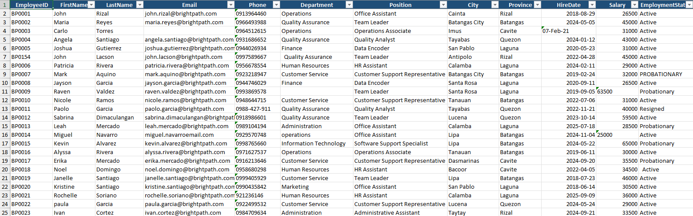
       
      <strong>Before</strong>
    </td>
    <td align="center">
      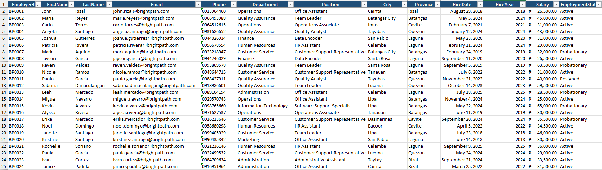
       
      <strong>After</strong>
    </td>
  </tr>
</table>

#### Comparison 2

<table align="center">
  <tr>
    <td align="center">
      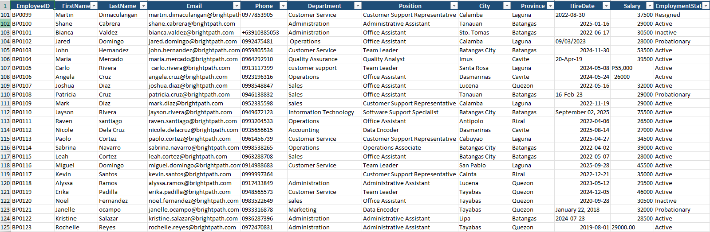
       
      <strong>Before</strong>
    </td>
    <td align="center">
      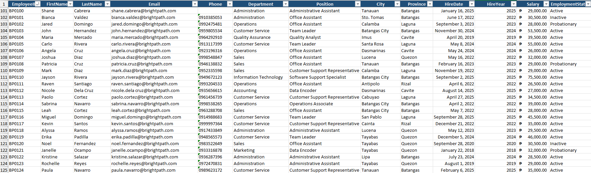
       
      <strong>After</strong>
    </td>
  </tr>
</table>

#### Comparison 3

<table align="center">
  <tr>
    <td align="center">
      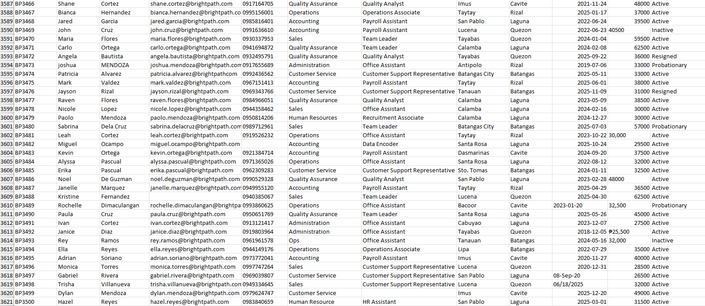
       
      <strong>Before</strong>
    </td>
    <td align="center">
      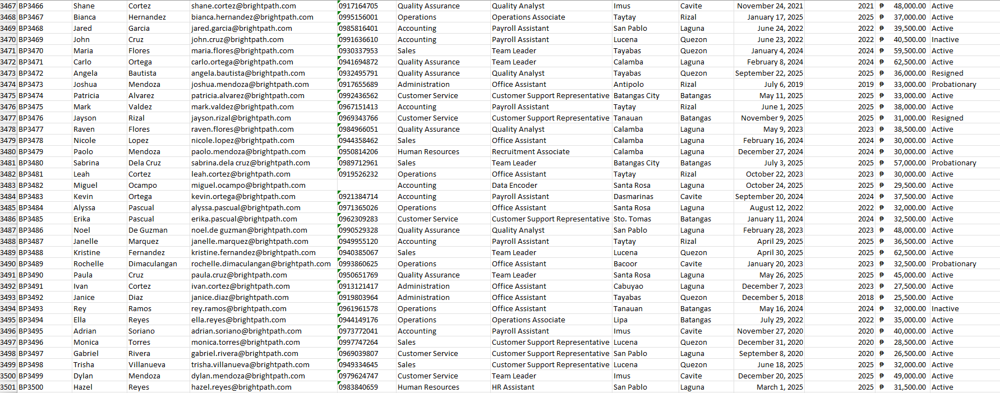
       
      <strong>After</strong>
    </td>
  </tr>
</table>

> These screenshots compare the same rows before and after cleanup to show how the workbook was standardized.

### Visual Workflow

  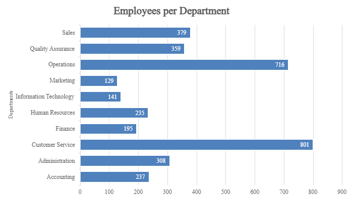

  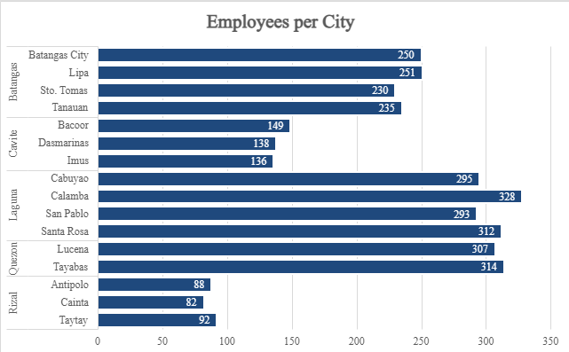

  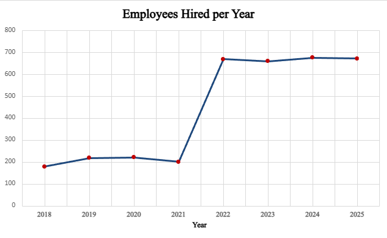

  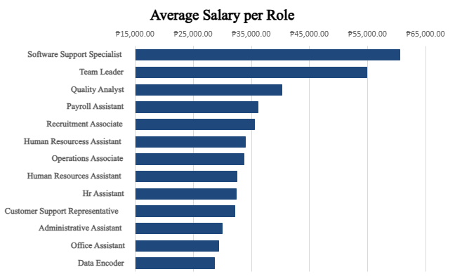

  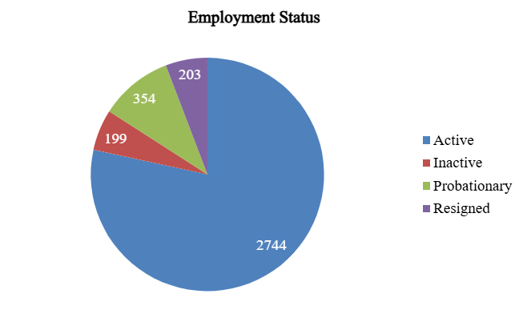

> The images above show the key stages and visual outputs from the finished Excel case study.

### Summary

The cleaned workbook shows the progression from raw, inconsistent records to a structured dataset ready for analysis, reporting, and presentation.

Together, the comparison screenshots and visual outputs show my ability to clean data, preserve structure, and present results clearly.

---

# 🏆 Certifications

- Data Engineer in SQL — DataCamp
- Data Engineer in Python — DataCamp

---

# 📄 Resume

A copy of my latest resume can be found in the **/resume** folder.

---

# 📬 Contact

**Email:**  
📧 cuartomicoraphael@gmail.com

**GitHub:**  
🔗 https://github.com/oocim

---

# 🎯 Career Objective

I am currently seeking opportunities in:

- Data Analytics
- Data Entry
- Virtual Assistant
- Administrative Support
- Data Processing
- Data Quality
- Operations Support

I am committed to delivering accurate, organized, and high-quality work while continuously learning and improving my skills.

---

## ⭐ Thank you for visiting!

If you're looking for someone who is detail-oriented, organized, and experienced in handling structured datasets, I'd be happy to contribute to your team.
